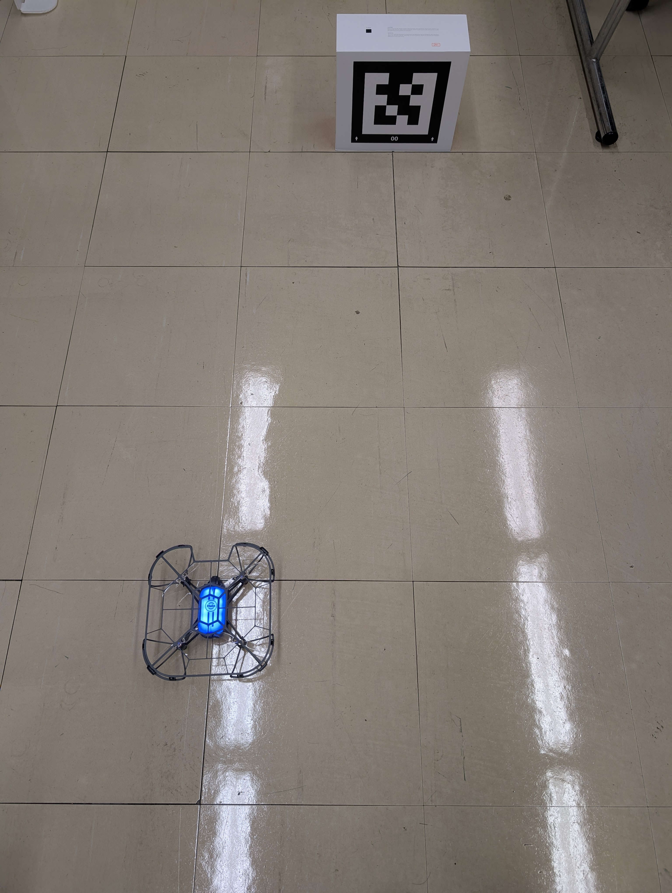
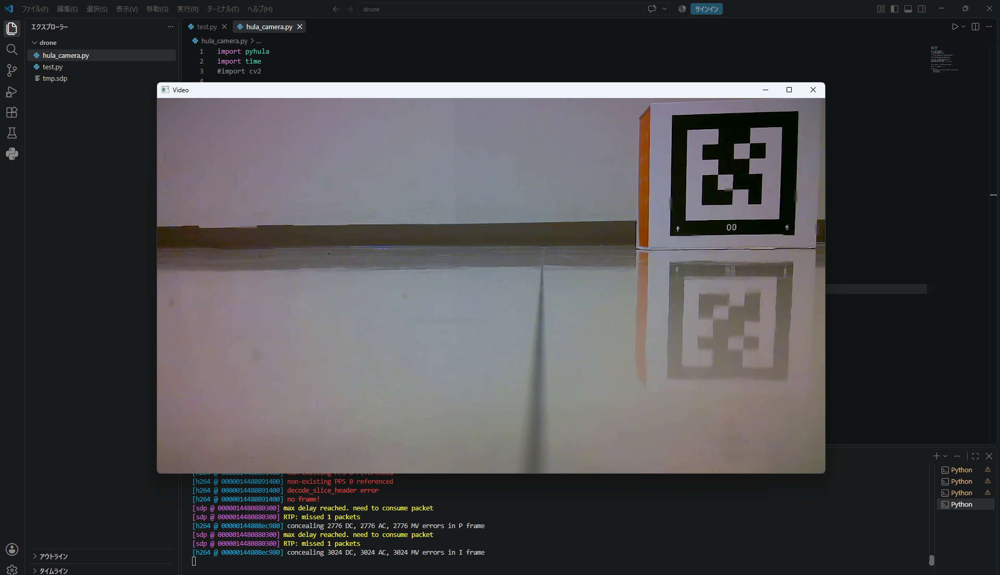

# Hulaカメラ

Hulaドローンのカメラ機能（映像ストリーム取得・ARマーカー認識・色認識）を pyhula から利用するためのサンプルです。

## 動画

前方（ジンバル）カメラの映像ストリーム（RTP）を有効化。ストリームを一度有効にしてから動画を出力することができます。

| メソッド | 引数 | 説明 |
| --- | --- | --- |
| Plane_cmd_swith_rtp(x) |	x = {0, 1}	映像ストリームの送信を切り替える。| 0: ビデオストリームを有効  
1: ビデオストリームを無効 |
single_fly_flip_rtp()	| なし	| 映像ストリームのウィンドウを開く。SPS/PPS（デコード情報）を受信させるために必要 |


### hula_camera01.py

```python
import pyhula
import time

api = pyhula.UserApi()
if not api.connect():
    print("connect error")
else:
    print("connection to station by wifi")
print(f"battery={api.get_battery()}")

# ストリーム有効化
api.Plane_cmd_swith_rtp(0)
api.single_fly_flip_rtp()
time.sleep(3)  # SPS/PPSが届くまで待つ

while True:
    time.sleep(0.1)
```

`Ctrl-C` でコードを止めることが可能です。

---

## カメラの向き

ジンバルカメラの向きを変えることも可能です。

| メソッド | 引数 | 説明 |
| --- | --- | --- |
| `Plane_cmd_camera_angle(type, data)` | `type`（下記参照）, `data = 0〜90`（度） | ジンバルカメラのピッチ角を調整する。`type` 0:上向き絶対 / 1:下向き絶対 / 5:上向き相対 / 6:下向き相対 |

### hula_camera02.py

```python
import pyhula
import time

api = pyhula.UserApi()
if not api.connect():
    print("connect error")
else:
    print("connection to station by wifi")
print(f"battery={api.get_battery()}")

# ストリーム有効化
api.Plane_cmd_swith_rtp(0)
api.single_fly_flip_rtp()
time.sleep(3)  # SPS/PPSが届くまで待つ

print("映像取得開始...")
api.Plane_cmd_camera_angle(1, 90)
while True:
    time.sleep(0.1)
```

`Ctrl-C` でコードを止めることが可能です。

---

## ARマーカー認識

前方カメラでARマーカー（QRコード）を認識します。

| メソッド | 引数 | 説明 |
| --- | --- | --- |
| `single_fly_Anticipatory_recognition(qr_id)` | `qr_id = 0〜9`（QR ID） | 前方カメラでARマーカーを認識する。戻り値は辞書 `{ result, x, y, z, angle, ... }`。`x`/`y`/`z` はドローンとマーカー間の距離、`angle` は角度（ヨー）、`result` は認識成否 |

参考：数字・矢印・アルファベットのタグを認識したい場合は `single_fly_AiIdentifies(mode)`（`mode` 0〜9:数字 / 10〜13:矢印 / 65〜90:A〜Z）も利用できます。

### hula_camera03.py

```python
import pyhula
import time

api = pyhula.UserApi()
if not api.connect():
    print("connect error")
else:
    print("connection to station by wifi")
print(f"battery={api.get_battery()}")

while True:
    arry = api.single_fly_Anticipatory_recognition(0)
    print(arry)
```

### 実行例


```bash
connect wifi
192.168.100.255 192.168.100.125
connection to station by wifi
battery=59
{'mode': 0, 'type': 2, 'x': 28, 'y': 82, 'z': 10, 'angle': 1925, 'result': True}
{'mode': 0, 'type': 2, 'x': 28, 'y': 82, 'z': 10, 'angle': 1925, 'result': True}
{'mode': 0, 'type': 2, 'x': 28, 'y': 82, 'z': 10, 'angle': 1925, 'result': True}
....

`Ctrl-C` でコードを止めることが可能です。

```


### ドローンとマーカーの位置関係

このタイルは1辺が30ｃｍのタイルです。



---

## 映像とマーカー認識

映像を取得しながらマーカーを認識することも可能です。
### hula_camera04.py

```python
import pyhula
import time

api = pyhula.UserApi()
if not api.connect():
    print("connect error")
else:
    print("connection to station by wifi")
print(f"battery={api.get_battery()}")

# ストリーム有効化（この順番が重要）
api.Plane_cmd_swith_rtp(0)
api.single_fly_flip_rtp()  # これが必要


time.sleep(3)  # SPS/PPSが届くまで待つ

print("映像取得開始...")
while True:
    arry = api.single_fly_Anticipatory_recognition(0)
    print(arry)
```

### 実行例

```bash
connect wifi
192.168.100.255 192.168.100.125
connection to station by wifi
battery=59
映像取得開始...
{'mode': 0, 'type': 2, 'x': 28, 'y': 82, 'z': 10, 'angle': 1925, 'result': True}
{'mode': 0, 'type': 2, 'x': 28, 'y': 82, 'z': 10, 'angle': 1925, 'result': True}
{'mode': 0, 'type': 2, 'x': 28, 'y': 82, 'z': 10, 'angle': 1925, 'result': True}
```
### カメラ映像




---

## 色認識

映像ストリームの現在フレームから代表色（RGB）を取得します。

| メソッド | 引数 | 説明 |
| --- | --- | --- |
| `single_fly_getColor()` | なし | 現在の映像フレームから色を取得する。戻り値は辞書 `{ r, g, b, state }`。`r`/`g`/`b` はRGB値、`state` は取得成否（`True`:成功、`False`:失敗） |

### hula_camera05.py

```python
import pyhula
import time
# import cv2

api = pyhula.UserApi()
if not api.connect():
    print("connect error")
else:
    print("connection to station by wifi")
print(f"battery={api.get_battery()}")

# コメントアウトを外せば映像を映すことも可能
# api.Plane_cmd_swith_rtp(0)
# api.single_fly_flip_rtp()  
time.sleep(3)  # SPS/PPSが届くまで待つ

# print("映像取得開始...")
while True:
    arry = api.single_fly_getColor()
    print(arry)
```

### 実行例
実行例は赤色の紙を前においたものです。用紙や環境によって値は大きくかわります。
```bash
connect wifi
192.168.100.255 192.168.100.125
connection to station by wifi
battery=42
{'r': 128, 'g': 144, 'b': 176, 'state': True}
{'r': 128, 'g': 144, 'b': 176, 'state': True}
{'r': 128, 'g': 144, 'b': 176, 'state': True}
```

---

## 旋回動作を用いたマーカー探索

ドローンがID:0のマーカーを発見するまで、10度つづ旋回するコードし、マーカーを見つけると着陸するコードです。

### hula_camera06.py
```python
import pyhula
import time

api = pyhula.UserApi()
if not api.connect():
    print("connect error")
else:
    print("connection to station by wifi")
print(f"battery={api.get_battery()}")

# ストリーム有効化（この順番が重要）
api.Plane_cmd_swith_rtp(0)
api.single_fly_flip_rtp()  

time.sleep(3)  # SPS/PPSが届くまで待つ

api.single_fly_takeoff()

print("映像取得開始...")
while True:
    api.single_fly_turnleft(10)
    arry = api.single_fly_Anticipatory_recognition(0)
    print(arry['result'])
    if arry['result']:
        print("マーカーを発見しました")
        break

api.single_fly_touchdown()
```


### 実行例
```
connect wifi
192.168.100.255 192.168.100.125
connection to station by wifi
battery=48
takeoff success
映像取得開始...
False
SFTurnLeftTP finish
False
SFTurnLeftTP finish
False
SFTurnLeftTP finish
False
SFTurnLeftTP finish
True
マーカーを発見しました
Touchdown not finish
```
ID:0を発見しても認識するには数秒かかることがあります。

## 課題
- ID:5のマーカーに向けてドローンを飛行させ、ドローンとマーカーの距離が1m以内になったところで着陸させてください。
